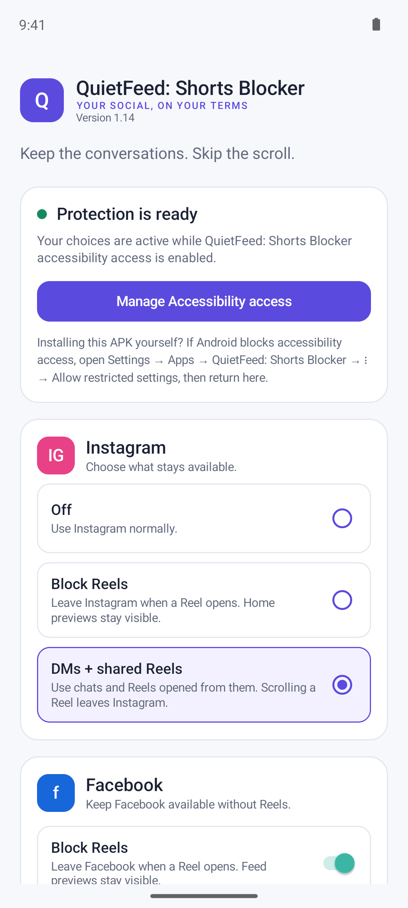
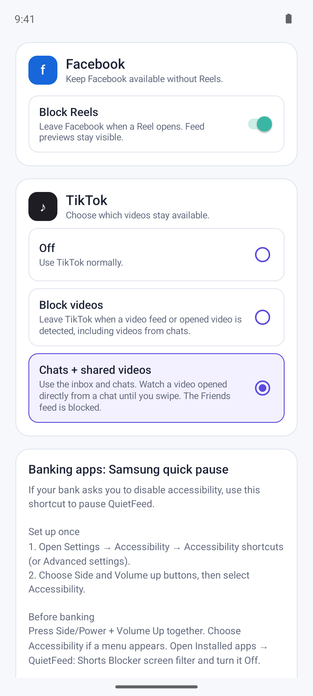
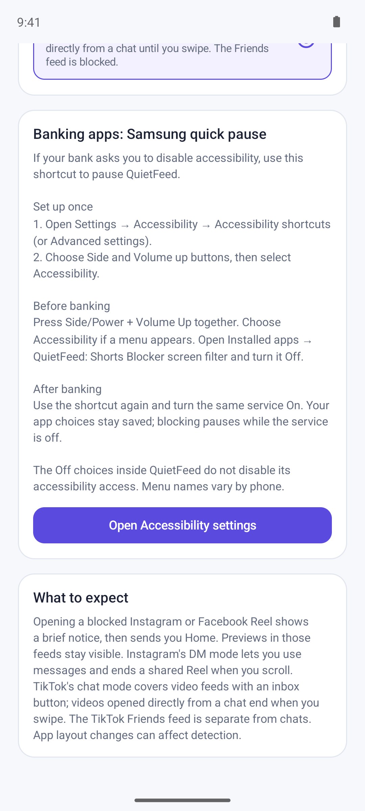

# QuietFeed: Shorts Blocker

Keep the conversations. Skip the scroll.

QuietFeed is a small, native Android app that blocks opened short-video viewers in Instagram, Facebook, and TikTok. Optional messages-only modes keep chats and videos opened from chats available. It runs locally through Android's Accessibility Service, with no account login or internet permission.

[](https://github.com/darren236/quiet-feed/actions/workflows/android.yml)
[](https://github.com/darren236/quiet-feed/releases/latest)
[](LICENSE)

**[Download QuietFeed 1.16 APK](https://github.com/darren236/quiet-feed/releases/download/v1.16/QuietFeed-1.16.apk)** · [Release notes](CHANGELOG.md)

Requires **Android 6.0 or newer (API 23)**; targets **Android 16 (API 36)**. Detection currently uses English interface labels.

## Screenshots

<table>
  <tr>
    <td><br><strong>Settings and Instagram controls</strong></td>
    <td><br><strong>Facebook and TikTok controls</strong></td>
    <td><br><strong>Banking shortcut guide</strong></td>
  </tr>
</table>

Actual QuietFeed 1.14 screens captured on an Android 14 emulator. These show the app's settings, not live social-app detection or a Samsung settings screen.

## Controls

| App | Options | What stays available |
| --- | --- | --- |
| Instagram | Off · Block Reels · DMs + shared Reels | Block Reels allows Home feed previews. DM mode allows the inbox, chats, and a Reel opened from a chat until the first video swipe. |
| Facebook | Off · Block Reels | Feed previews remain visible; detected opened Reels send you Home. |
| TikTok | Off · Block videos · Chats + shared videos | Chat mode allows the inbox, chats, and a video opened from a chat until the first video swipe. The Friends feed is blocked. Block videos also blocks opened chat videos. |

- Detected comment panels remain available for reading, writing, and scrolling. Closing comments preserves the same allowed shared video.
- A detected blocked viewer shows a brief centered notice before sending you to the phone's Home screen. This does not force-stop the social app.
- Messages-only gates include **Open messages** to select a detected Instagram Messages tab or TikTok inbox.
- Defaults: Instagram **Block Reels**, Facebook blocking **On**, TikTok **Off**.

Shared-video modes recognize the path from a chat into a video. **They do not verify that the sender is a friend.**

## Install and enable

1. Download the APK from [GitHub Releases](https://github.com/darren236/quiet-feed/releases/latest), open it on your phone, and allow installation from that source when Android asks.
2. Open QuietFeed and choose your app modes.
3. Tap **Open Accessibility settings**, then enable **Installed apps → QuietFeed: Shorts Blocker screen filter**. You must grant this access manually.

If Android shows **Restricted setting**, open **Settings → Apps → QuietFeed: Shorts Blocker → More (⋮) → Allow restricted settings**, then return to Accessibility. This can be required for sideloaded apps on Android 13 and newer. Menu names vary by device. See [Android's restricted-settings instructions](https://support.google.com/android/answer/12623953).

For a USB-connected phone with debugging enabled and `adb` on your path:

```sh
adb install -r dist/QuietFeed-1.16.apk
```

## Samsung shortcut for banking apps

Some banking apps require accessibility services to be disabled. Set up a hardware shortcut to reach QuietFeed's switch quickly:

1. Open **Settings → Accessibility → Accessibility shortcuts → Side and Volume up buttons**. Select **Accessibility** to open its settings. Some One UI versions call the shortcut menu **Advanced settings**. See [Samsung's shortcut guide](https://www.samsung.com/us/support/answer/ANS10001906/) and [older menu instructions](https://www.samsung.com/ca/support/mobile-devices/set-up-the-side-button-or-bixby-key-on-your-galaxy-phone/).
2. Before banking, press **Side/Power + Volume up** together. If a chooser appears, select **Accessibility**.
3. Open **Installed apps → QuietFeed: Shorts Blocker screen filter** and turn the service **Off**. Then open your banking app.
4. After banking, use the same shortcut and turn the service **On** again.

If QuietFeed itself is offered as a shortcut action, selecting it may let the buttons toggle the service directly. Confirm that the service is **Off** before banking; shortcut actions vary by phone and software version.

**Setting app modes to Off does not disable the accessibility service.** Protection stops while the service is disabled; your selected modes remain saved. QuietFeed does not bypass a bank's accessibility checks.

## Privacy and limitations

Android's accessibility permission can expose window contents. QuietFeed receives accessibility events to track foreground windows and system overlays, then collects visible UI nodes from supported social apps for local classification. It does not store message contents, capture screenshots, send analytics, request social-media passwords, or request internet permission. Only your app-mode preferences are saved locally.

Detection uses English accessibility labels, view IDs, and screen geometry. Other languages, interface experiments, and social-app updates can cause missed blocks or false blocks. A blocked video may appear briefly before detection. Unknown screens can remain unrecognized in blocking mode or show the messages gate in messages-only mode. Shared-video origin and comment transitions are inferred from the interface; ambiguous navigation can affect that allowance.

This is a personal focus tool, not a tamper-resistant parental-control system. You can change modes, disable the service, or uninstall the app. There is no affiliation with Instagram, Facebook, TikTok, or their owners.

## Build and development

### Requirements

- **JDK 17**, Android SDK **Platform 36**, **Build Tools 36.0.0**, and Platform Tools.
- The included wrapper uses **Gradle 9.3.1** with **Android Gradle Plugin 8.12.0**.
- **OpenSSL** for the release script's first-time signing setup.
- Set `JAVA_HOME` and `ANDROID_HOME` to your installations. The release script also recognizes the usual Homebrew paths on macOS.

Install the Android SDK components with Android Studio's SDK Manager or the command-line tools:

```sh
sdkmanager 'platforms;android-36' 'build-tools;36.0.0' 'platform-tools'
```

Accept the SDK licenses when prompted. Gradle downloads dependencies on the first build.

Open `gradle-app/` in Android Studio, or run:

```sh
./gradle-app/gradlew -p gradle-app --no-daemon :app:check :app:assembleDebug
```

Debug builds and checks do not require release signing files. The `screenRulesTest` task runs plain Java fixtures for screen classification, shared-video eligibility, and comment transitions. It is included in `check`, unit-test tasks, and release builds. GitHub Actions runs checks and a debug build on pushes and pull requests without release secrets. These fixtures do not replace device testing of real app layouts, event timing, overlays, or navigation; see the [device checklist](CONTRIBUTING.md#device-checklist).

### Signed release APK

```sh
./build.sh
```

The result is `dist/QuietFeed-1.16.apk`. On a fresh checkout, the script creates `build/quietfeed.keystore` and a random password in `build/signing.properties`; both are ignored by Git. Back them up securely and reuse them for your own subsequent releases. A locally generated key differs from the official release key, so that build cannot update an official APK in place. A direct Gradle release build is unsigned when local signing files are absent.

### Code structure

`MainActivity` provides native settings. `ShieldService` handles accessibility events, windows, gates, and Home actions. The plain Java `ScreenRules`, `ChatVideoOrigin`, `SharedReelComments`, and `ReelViewerState` helpers classify screens and track temporary shared-video permissions and paging.

This is one Git checkout. `src/`, `res/`, and `AndroidManifest.xml` are the app source; `gradle-app/` points to those files and is not another app copy. `dist/` contains the installable APK, while Gradle's APK output is an intermediate build artifact. Generated outputs and signing files are ignored. Published versions use Git tags and GitHub Releases; preserve existing releases and publish a new version for later changes.

## Contributing and security

Detection fixes and reproducible bug reports are welcome. Read [CONTRIBUTING.md](CONTRIBUTING.md) for checks and safe screen fixtures, and [SECURITY.md](SECURITY.md) for reporting vulnerabilities privately.

## License

QuietFeed is available under the [MIT License](LICENSE).
